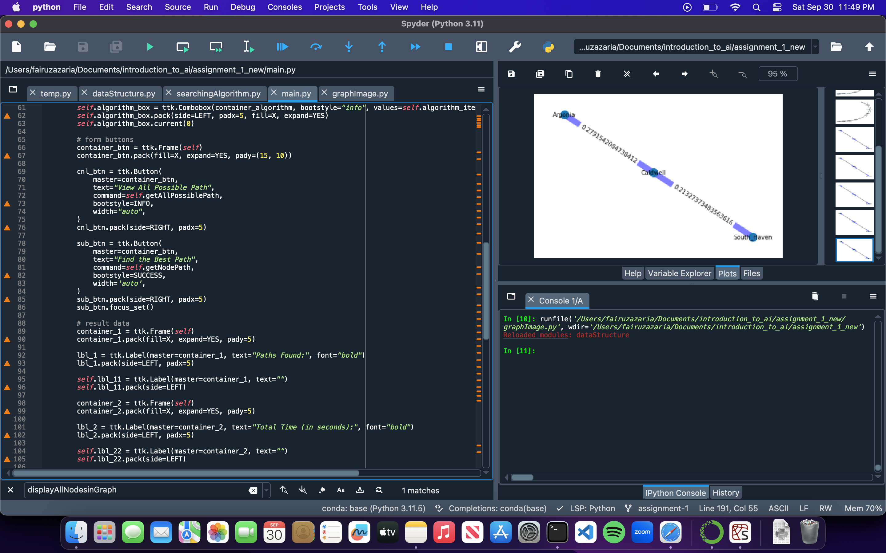

# comp_sci_461_introduction_to_ai - ASSIGNMENT 1

This is a Python program that provides searching algorithm to find a path between two nodes. The algorithm consist of informed and uninformed search algorithm. In order to run this program, there are a few python modules that need to be installed. Those modules are:

ttkbootstrap
pandas
heapq
networkx
matplotlib
I recommend to run this program through Spyder from Anaconda since most of that modules are already pre installed with Anaconda(except ttkbootstrap). Some things to note is that, if you use Spyder in MAC OS to run this program, be sure to close the program from the dock by right clicking it and pressing quite / force quit from there.

I hope this repository is usefull, thank you for coming!

