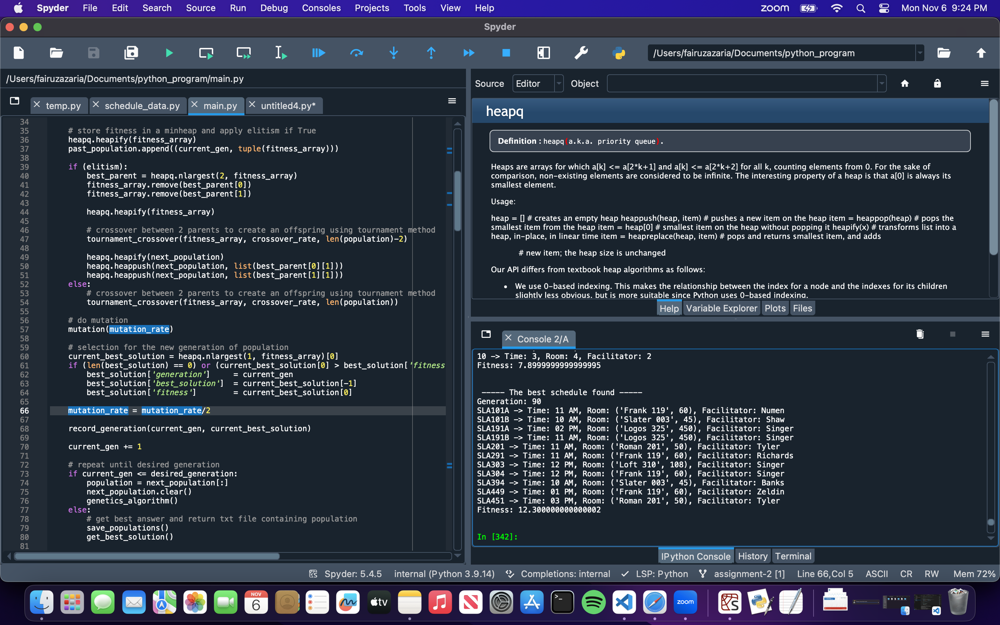

# comp_sci_461_introduction_to_ai - ASSIGNMENT 2

This is my Python progam to implement Genetic Algorithm in order to solve space utilization schedule problem. I do not think there is a specific library to be installed to use this program. The program currently does not have a user interfaces, so all of the outputs are printed in the console/terminal.

I hope this repository is usefull, thank you for coming!

